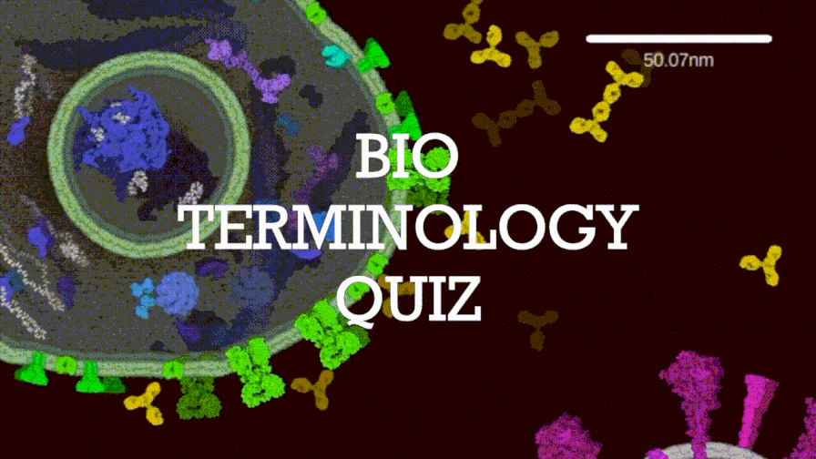

# LGBTQ++ 

 

Drawing program : CellPAINT [ 1 ]. 

## Description 

* LGBTQ++ ( Learning General Bio Terminology by Quiz C++ ) 
* 高校生物における重要単語の**英訳**を, クイズ形式で出題するプログラムです. 
* CUIツールです.  
* Unix系環境 ( Mac OS / Linux )とWindows環境で利用できます. 
* Enjoy. 

## Dependencies 

* C++言語 ( C++17 規格 ) 

## Downloads 

以下のリンクをクリックしてZIPファイルをダウンロード出来ます. 

* [ Linux版 ]( https://github.com/shin-kinos/lgbtq-plus-plus/releases/download/v1.0.0/lgbtq-linux.tar.gz ) 
* [ MacOS版 ]( https://github.com/shin-kinos/lgbtq-plus-plus/releases/download/v1.0.0/lgbtq-macos.zip ) 
* [ Windows版 ]() 

ダウンロードしたZIPファイルを, 任意のディレクトリで解凍してください. 

## Compilation 

C++17 規格にて構築されたC++言語ソースファイルをコンパイル出来るコンパイラーで, 本プログラムをコンパイルして下さい. 

✅以下のコンパイラーでプログラムが正常にコンパイルされ, 動作することを確認しています. 

* GCC Homebrew ( version `10.2.1` ) 
* GCC Apple clang ( version `12.0.5` ) 
* GCC MinGW ( version `8.2.0` ) 

[ 例 ] 

```
% cd lgbtq-macos
% g++ lgbtq.c++ -O2 -std=c++17 -o lgbtq
``` 

カレントディレクトリにオブジェクトファイル`lgbtq`が取得されます. 

## Usage 

### 1. オブジェクトファイルの実行 

ターミナルでオブジェクトファイルを実行してください. 

[ 例 ] 

``` 
% ./lgbtq 
``` 

### 2. 出題範囲の設定 

**半角数字**`1`, `2`または`3`を入力し, クイズの出題範囲を設定してください. 例として, 「高校生物・最重要用語 (改訂)」を出題範囲としたい場合, `1`と入力してください. 

出題範囲は以下の通りです. 

1. 高校生物・最重要用語 ( 251 語 ) 
2. 高校生物・重要用語 ( 243 語 ) 
3. 「高校生物・最重要用語」と「高校生物・重要用語」の両方 ( 251 語 + 243 語 ) 

[ 例 ] 

``` 
出題リストを設定して下さい (半角数字 1, 2 or 3).

1. 高校生物・最重要用語 (改訂)
2. 高校生物・重要用語 (改訂)
3. 「高校生物・最重要用語 (改訂)」と「高校生物・重要用語 (改訂)」の両方
: 1

``` 

### 3. 単元の設定 

**半角数字** `0` ~ `32` を入力することによって, 出題される単元を選択してください. 

⚠️入力数字を**半角カンマで区切る**ことによって, 複数の単元を選択することが可能です. 例として, 単元「[基礎]生物の共通性と多様性」, 「[基礎]細胞とエネルギー」, 「進化の仕組み」, 「バイオテクノロジー」及び「動物の行動」の5 つの単元をまとめて出題単元としたい場合は, `1,2,11,21,23`と入力してください. 

出題単元は以下の通りです. 

1. [基礎]生物の共通性と多様性 
2. [基礎]細胞とエネルギー 
3. [基礎]遺伝情報とDNA 
4. [基礎]遺伝情報の分配 
5. [基礎]遺伝情報とタンパク質の合成 
6. [基礎]体内環境の維持の仕組み 
7. [基礎]免疫 
8. [基礎]植生と遷移 
9. [基礎]気候とバイオーム 
10. 有性生殖/減数分裂と受精 
11. 進化の仕組み 
12. 生物の分類と系統 
13. 細胞と分子/生体物質と細胞 
14. 細胞と分子/生命現象とタンパク質 
15. 代謝/呼吸と光合成 
16. 代謝/窒素同化 
17. 遺伝情報の発現 
18. 遺伝子の発現調節 
19. 動物の発生 
20. 植物の発生 
21. バイオテクノロジー 
22. 刺激の受容と反応 
23. 動物の行動 
24. 植物の環境応答 
25. 個体群と生物群集 
26. 生態系と生物多様性 
27. [基礎]体内環境 
28. [基礎]生態系と物質循環 
29. [基礎]生態系のバランスと保全 
30. 有性生殖/遺伝子と染色体 
31. 動物の個体・器官・働き 
32. 植物の個体・器官・働き 

[ 例 ] 

```
出題範囲を設定して下さい (半角数字 0 - 32, 複数選択可). 
例 : 1,2,3,12,15,28,9

0	#	全ての単元
1	#	[基礎]生物の共通性と多様性
2	#	[基礎]細胞とエネルギー
3	#	[基礎]遺伝情報とDNA
4	#	[基礎]遺伝情報の分配
5	#	[基礎]遺伝情報とタンパク質の合成
6	#	[基礎]体内環境の維持の仕組み
7	#	[基礎]免疫
8	#	[基礎]植生と遷移
9	#	[基礎]気候とバイオーム
10	#	有性生殖/減数分裂と受精
11	#	進化の仕組み
12	#	生物の分類と系統
13	#	細胞と分子/生体物質と細胞
14	#	細胞と分子/生命現象とタンパク質
15	#	代謝/呼吸と光合成
16	#	代謝/窒素同化
17	#	遺伝情報の発現
18	#	遺伝子の発現調節
19	#	動物の発生
20	#	植物の発生
21	#	バイオテクノロジー
22	#	刺激の受容と反応
23	#	動物の行動
24	#	植物の環境応答
25	#	個体群と生物群集
26	#	生態系と生物多様性
27	#	[基礎]体内環境
28	#	[基礎]生態系と物質循環
29	#	[基礎]生態系のバランスと保全
30	#	有性生殖/遺伝子と染色体
31	#	動物の個体・器官・働き
32	#	植物の個体・器官・働き
: 1,2,11,21,23
``` 

これで準備完了です. 12 択のクイズ形式で英訳の問題が出題されます. 

## Additional information 

### 【Windows】GCC ( MinGW )のインストール 

Windows環境でかつGCC ( MinGW )がインストールされていない場合は, これをインストールする必要があります. 

* MinGW ( https://www.mingw-w64.org/ ) 
* MinGWのインストール方法 ( https://webkaru.net/clang/mingw-gcc-install/ ) [ 2 ] 

### 高校生物における重要単語 

本プログラムでクイズとして使用した高校生物の重要単語とその英訳 ( 全 494 語 )は, 日本学術会議による報告 [ 3 ] とその改訂版 [ 4 ] を基に選出されました. 

### 日本語が正しく表示されない場合　

コマンドプロンプト, ターミナルで使用されているフォントが日本語に対応していない場合があります. コマンドプロンプト, ターミナルの設定から, 日本語をサポートしているフォントに変更してください. 

* 【Windows】コマンドプロンプトのフォントを変更する方法 ( https://www.javadrive.jp/command/ini/index3.html ) [ 5 ] 
* 【Mac OS】ターミナルのフォントを変更する方法 ( https://support.apple.com/ja-jp/guide/terminal/trmltxt/mac ) [ 6 ] 

## References 

1. Gardner, Adam, et al. "CellPAINT: interactive illustration of dynamic mesoscale cellular environments." IEEE computer graphics and applications 38.6 (2018). 
2. Webkaru. C言語入門. "MinGW - gcc の インストール - Windows環境". https://webkaru.net/clang/mingw-gcc-install/ ( Accessed on March 3, 2022 ). 
3. 日本学術会議. "高等学校の生物教育における重要用語の選定について". https://www.scj.go.jp/ja/member/iinkai/kanji/pdf23/siryo252-5-3.pdf ( Accessed on February 14, 2022 ). 
4. 日本学術会議. "高等学校の生物教育における重要用語の選定について (改訂)". https://www.scj.go.jp/ja/info/kohyo/pdf/kohyo-24-h190708.pdf ( Accessed on February 14, 2022 ). 
5. Let'sプログラミング. コマンドプロンプトの使い方. コマンドプロンプトの基本. "文字のサイズとフォントの種類を設定する". https://www.javadrive.jp/command/ini/index3.html ( Accessed on March 8, 2022 ). 
6. Official Apple Support. ターミナルユーザガイド. "Macの「ターミナル」で「プロファイル」の「テキスト」環境設定を変更する". https://support.apple.com/ja-jp/guide/terminal/trmltxt/mac ( Accessed on March 8, 2022 ). 
